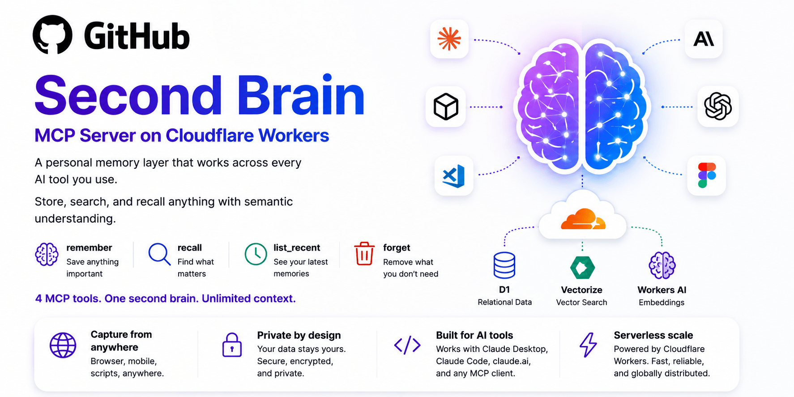

# Second Brain — MCP Server on Cloudflare Workers

**A personal memory layer that works across every AI tool you use.**  
Self-hosted on Cloudflare's free tier. Truly one-click deploy — no manual setup required.

> **🔑 Before you deploy:** You'll be asked to set an `AUTH_TOKEN` during deployment.  
> **Quick option:** Use a memorable phrase like `coffee-lover-2026`  
> **Secure option:** Run `openssl rand -base64 32` in your terminal and paste the result  
> **Save it!** You'll need this token to connect AI clients.

[](https://deploy.workers.cloudflare.com/?url=https://github.com/rahilp/second-brain-cloudflare)

[](LICENSE)
[](https://workers.cloudflare.com/)
[](https://modelcontextprotocol.io/)

---

Every AI conversation starts from zero. Second Brain fixes that — give Claude, ChatGPT, Cursor, and any MCP-compatible client a shared memory layer that actually remembers what you tell it.

**Five tools. One brain. Every AI client.**

| Tool | Description |
|---|---|
| `remember` | Store anything — ideas, decisions, project context |
| `append` | Add updates to existing entries without creating duplicates |
| `recall` | Semantic search with recency bias — finds things by meaning, prioritizes fresh info. In the Web UI, results are synthesized into a natural answer with source memories shown below. |
| `list_recent` | Browse recent memories chronologically |
| `forget` | Delete an entry and all its chunks |

---

## Quickstart

1. **Click Deploy** — Cloudflare provisions D1, Vectorize, and the Worker automatically
2. **Choose your token** — During deploy, enter a memorable token (like `coffee-lover-2026`) or generate a secure one with `openssl rand -base64 32`. Save it!
3. **That's it!** — Schema auto-creates on first request. Your Worker is ready at `https://<your-worker-url>/`
4. **Connect to Claude** — [instructions →](../../wiki/Connect-to-AI-Clients)

```bash
# Test it's working (use your token from step 2)
curl -X POST https://<your-worker-url>/capture \
  -H "Authorization: Bearer coffee-lover-2026" \
  -H "Content-Type: application/json" \
  -d '{"content": "second brain is working", "source": "test"}'
# → {"ok":true,"id":"..."}
```

---

## Documentation

- [Setup Guide](../../wiki/Setup-Guide) — one-click deploy, token setup, connecting AI clients
- [How It Works](../../wiki/How-It-Works) — semantic search, chunking, duplicate detection
- [Connect to AI Clients](../../wiki/Connect-to-AI-Clients) — Claude Desktop, Claude Code, claude.ai, iOS, Claude instructions
- [Capture from Anywhere](../../wiki/Capture-from-Anywhere) — browser bookmarklet, iOS Shortcuts, share sheet
- [Web UI](../../wiki/Web-UI) — Dashboard UI and mobile interface
- [Obsidian Plugin](../../wiki/Obsidian-Plugin) — install, configure, sync modes
- [API Reference](../../wiki/API-Reference) — /capture, /list, /mcp endpoints

---

## Stack

Cloudflare Workers · D1 SQLite · Vectorize · Workers AI · MCP TypeScript SDK · MIT License

All free tier at personal scale.

---

## Integrations

- **Obsidian** — [second-brain-obsidian-plugin](https://github.com/rahilp/second-brain-obsidian-plugin) · available in [Obsidian Community Plugins](https://community.obsidian.md/plugins/second-brain-sync)
- **iOS** — Brain Dump, Text Brain Dump, and Save to Brain shortcuts in [`integrations/ios-shortcuts/`](integrations/ios-shortcuts/)
- **Browser** — bookmarklet in [`integrations/bookmarklet.js`](integrations/bookmarklet.js)

---

[MIT License](LICENSE) · [Discussions](https://github.com/rahilp/second-brain-cloudflare/discussions)
