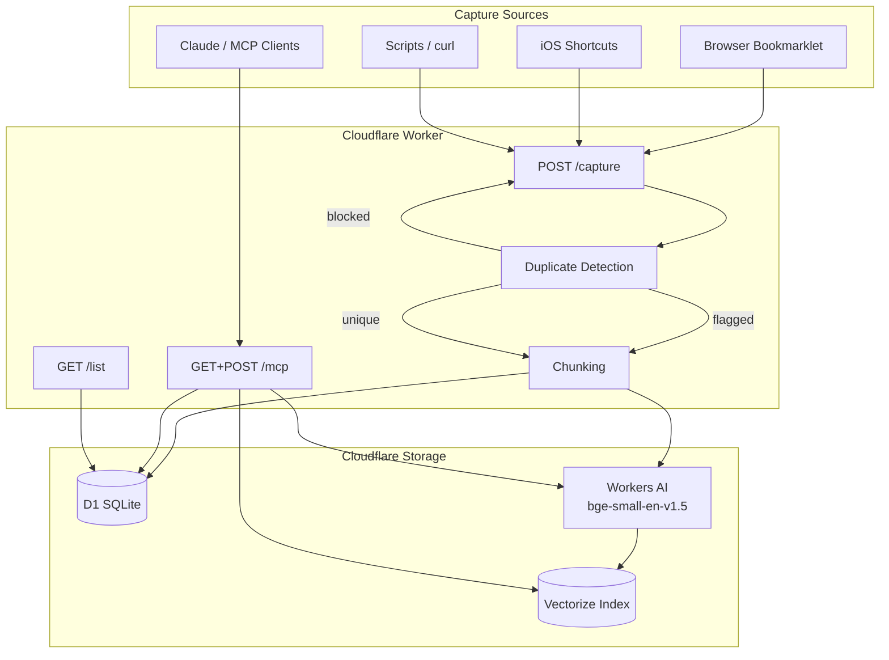

# Second Brain — MCP Server on Cloudflare Workers

**A personal memory layer that works across every AI tool you use.**  
Store, search, and recall anything with semantic understanding — deployed on Cloudflare's free tier in minutes.

[](https://deploy.workers.cloudflare.com/?url=https://github.com/YOUR_GITHUB_USERNAME/YOUR_REPO_NAME)

[](LICENSE)
[](https://workers.cloudflare.com/)
[](https://modelcontextprotocol.io/)

---

## Table of Contents

- [What is this?](#what-is-this)
- [How it works](#how-it-works)
- [Quickstart](#quickstart)
- [Manual Setup](#manual-setup)
- [Usage Examples](#usage-examples)
- [Connect to AI Clients](#connect-to-ai-clients)
  - [Claude Desktop](#claude-desktop)
  - [Claude Code](#claude-code)
  - [claude.ai & iOS](#claudeai--ios)
- [Capture from Anywhere](#capture-from-anywhere)
  - [Browser Bookmarklet](#browser-bookmarklet)
  - [iOS Shortcuts](#ios-shortcuts)
  - [Share Sheet](#share-sheet)
- [API Reference](#api-reference)
- [MCP Tools](#mcp-tools)
- [How Semantic Search Works](#how-semantic-search-works)
- [Chunking](#chunking)
- [Duplicate Detection](#duplicate-detection)
- [Stack](#stack)
- [Local Development](#local-development)

---

## What is this?

Most AI tools forget everything between conversations. **Second Brain** fixes that.

It's a lightweight Cloudflare Worker that gives any MCP-compatible AI client (Claude Desktop, Claude Code, claude.ai, etc.) a persistent memory store — with **semantic search** powered by vector embeddings. You can capture notes from your browser, phone, or scripts, then have your AI automatically recall relevant context at the start of every session.

**Five MCP tools. One second brain. Unlimited context.**

| Tool | Parameters | Description |
|---|---|---|
| `remember` | `content` (string), `tags?` (string[]), `source?` (string) | Store a note. Runs duplicate check first — blocked if near-exact match exists, flagged if similar. |
| `append` | `id` (string), `addition` (string) | Append new information to an existing entry. Preserves original, adds update with timestamp. Use when something has changed rather than storing a duplicate. |
| `recall` | `query` (string), `topK?` (1–20, default 5), `tag?` (string) | Semantic vector search with chunk deduplication, optionally filtered by tag |
| `list_recent` | `n?` (1–50, default 10), `tag?` (string) | Chronological listing, optionally filtered by tag |
| `forget` | `id` (string) | Delete an entry and all its chunks and update chunks from both D1 and Vectorize |

---

## How it works



Every note is embedded as a 384-dimensional vector using `bge-small-en-v1.5` on Workers AI. Semantic search queries the Vectorize index using cosine similarity — so "users drop off at the payment step" matches "onboarding problems" even though no keywords overlap.

Long notes are automatically split into overlapping chunks before embedding so each segment gets a clean vector. Near-duplicate content is detected and blocked or flagged before storing. Updates to existing entries are appended with a timestamp rather than stored as duplicates.

---

## Quickstart

The fastest path to a running second brain is the one-click deploy:

1. **Click Deploy** → Cloudflare forks the repo, provisions D1 + Vectorize, and deploys the Worker automatically.

   [](https://deploy.workers.cloudflare.com/?url=https://github.com/YOUR_GITHUB_USERNAME/YOUR_REPO_NAME)

2. **Run the schema** in Cloudflare Dashboard → D1 → `second-brain-db` → Console:

   ```sql
   CREATE TABLE IF NOT EXISTS entries (
     id          TEXT PRIMARY KEY,
     content     TEXT NOT NULL,
     tags        TEXT NOT NULL DEFAULT '[]',
     source      TEXT NOT NULL DEFAULT 'api',
     created_at  INTEGER NOT NULL
   );
   CREATE INDEX IF NOT EXISTS idx_entries_created_at ON entries(created_at DESC);
   CREATE INDEX IF NOT EXISTS idx_entries_source ON entries(source);
   ```

3. **Set your auth token**:

   ```bash
   openssl rand -base64 32   # generate a secure token
   wrangler secret put AUTH_TOKEN
   ```

4. **Test it**:

   ```bash
   curl -X POST https://<your-worker-url>/capture \
     -H "Authorization: Bearer YOUR_TOKEN" \
     -H "Content-Type: application/json" \
     -d '{"content": "second brain is working", "source": "test"}'
   # → {"ok":true,"id":"..."}
   ```

5. **Connect to Claude** → see [Connect to AI Clients](#connect-to-ai-clients).

> Your Worker URL is in Cloudflare Dashboard → Workers & Pages → `second-brain`.  
> It looks like: `https://second-brain.<your-subdomain>.workers.dev`

---

## Manual Setup

If you prefer to deploy manually from a clone:

### Prerequisites

- [Node.js](https://nodejs.org/) 18+
- A [Cloudflare account](https://dash.cloudflare.com/sign-up) (free tier works)
- `wrangler` CLI (installed automatically via `npm install`)

### Steps

```bash
# 1. Clone and install
git clone https://github.com/YOUR_GITHUB_USERNAME/YOUR_REPO_NAME.git
cd YOUR_REPO_NAME
npm install

# 2. Authenticate with Cloudflare
npx wrangler login

# 3. Create the D1 database
npm run db:create
# Copy the database_id output and paste it into wrangler.toml → [[d1_databases]] → database_id

# 4. Create the Vectorize index
npm run vectors:create

# 5. Run the schema migration
npm run db:migrate:remote

# 6. Set your auth token
openssl rand -base64 32
npx wrangler secret put AUTH_TOKEN

# 7. Deploy
npm run deploy
```

---

## Usage Examples

### Store a note (curl)

```bash
curl -X POST https://<your-worker-url>/capture \
  -H "Authorization: Bearer YOUR_TOKEN" \
  -H "Content-Type: application/json" \
  -d '{
    "content": "Decided to use Cloudflare Workers for the API instead of Vercel — better cold start times and the free D1 DB is perfect for this scale.",
    "tags": ["architecture", "decision"],
    "source": "notes"
  }'
```

```json
{ "ok": true, "id": "f47ac10b-58cc-4372-a567-0e02b2c3d479" }
```

### List recent entries

```bash
curl "https://<your-worker-url>/list?n=5" \
  -H "Authorization: Bearer YOUR_TOKEN"
```

### Semantic recall via Claude (MCP)

Once connected, ask Claude naturally:

> **You:** "What do I know about infrastructure decisions?"  
> **Claude (calling `recall`):** *"1. [May 10 · notes] (94%) Decided to use Cloudflare Workers for the API instead of Vercel — better cold start times..."*

---

## Connect to AI Clients

### Claude Desktop

Add to `~/Library/Application Support/Claude/claude_desktop_config.json`:

```json
{
  "mcpServers": {
    "second-brain": {
      "command": "npx",
      "args": ["mcp-remote", "https://<your-worker-url>/mcp"]
    }
  }
}
```

Restart Claude Desktop, then add this to **Settings → Custom Instructions**:

```
You have access to a personal second brain via MCP tools: remember, recall, list_recent, forget, append.

MANDATORY RULES — no exceptions:

1. At the start of EVERY conversation, call recall with the main topic before responding to anything. Do not skip this even if the topic seems simple.

2. Store EVERYTHING important automatically — call remember whenever the user mentions:
   - Anything personal (goals, preferences, habits, relationships, health)
   - Work context (projects, decisions, strategies, problems, progress)
   - Ideas or plans (even half-formed ones)
   - Tasks or commitments ("I need to", "I'm going to", "we decided")
   - Opinions or reactions ("I think", "I like", "I don't want")

3. When something has changed or evolved, use append instead of remember — call append whenever the user says things like "actually", "we changed our minds", "update that", "I've decided", "that's no longer true", or "we reversed that decision". Never store a duplicate when an update to an existing entry is more appropriate.

4. Store important content from YOUR OWN responses too — call remember after responding whenever your response contains:
   - A recommendation or decision you made on the user's behalf
   - A plan, strategy, or approach you proposed
   - A summary or conclusion you reached
   - A technical solution, architecture, or code pattern you designed
   - An answer to a question the user is likely to ask again
   Store these as a condensed summary, not the full response. Tag with "claude-response" plus any relevant project tags.

5. Never ask permission to store — store silently and keep going.

6. NEVER use Claude's built-in memory system. If you would normally save a memory, call remember instead. Always.

7. Auto-detect the current topic or project and include it as a tag (e.g. if discussing a website, tag it "website"; if discussing a specific company or product, use that name as a tag). Always combine specific tags with generic ones.

Tags to use:
- personal — life, preferences, habits
- work — projects, decisions, strategy
- idea — concepts, plans, brainstorms
- task — things to do or follow up on
- context — background info about ongoing situations
- claude-response — summaries of important responses Claude gave
- [auto-detected project/topic tag]

Always set source to "claude-desktop" when storing.

If the second brain MCP tools are unavailable, tell me immediately. Do not fall back to built-in memory silently.
```

### Claude Code

```bash
claude mcp add second-brain "npx" "mcp-remote" "https://<your-worker-url>/mcp"
```

Create `~/.claude/CLAUDE.md`:

```markdown
# Second Brain — mandatory rules

You have access to a personal second brain via MCP tools: remember, recall, list_recent, forget, append.

MANDATORY RULES — no exceptions:

1. At the start of EVERY conversation, call recall with the main topic before responding to anything. Do not skip this even if the topic seems simple.

2. Store EVERYTHING important automatically — call remember whenever the user mentions:
   - Anything personal (goals, preferences, habits, relationships, health)
   - Work context (projects, decisions, strategies, problems, progress)
   - Ideas or plans (even half-formed ones)
   - Tasks or commitments ("I need to", "I'm going to", "we decided")
   - Opinions or reactions ("I think", "I like", "I don't want")

3. When something has changed or evolved, use append instead of remember — call append whenever the user says things like "actually", "we changed our minds", "update that", "I've decided", "that's no longer true", or "we reversed that decision". Never store a duplicate when an update to an existing entry is more appropriate.

4. Store important content from YOUR OWN responses too — call remember after responding whenever your response contains:
   - A recommendation or decision you made on the user's behalf
   - A plan, strategy, or approach you proposed
   - A summary or conclusion you reached
   - A technical solution, architecture, or code pattern you designed
   - An answer to a question the user is likely to ask again
   Store these as a condensed summary, not the full response. Tag with "claude-response" plus any relevant project tags.

5. Never ask permission to store — store silently and keep going.

6. NEVER use Claude's built-in memory system. If you would normally save a memory, call remember instead. Always.

7. Auto-detect the current topic or project and include it as a tag (e.g. if discussing a website, tag it "website"; if discussing a specific company or product, use that name as a tag). Always combine specific tags with generic ones.

Tags to use:
- personal — life, preferences, habits
- work — projects, decisions, strategy
- idea — concepts, plans, brainstorms
- task — things to do or follow up on
- context — background info about ongoing situations
- claude-response — summaries of important responses Claude gave
- [auto-detected project/topic tag]

Always set source to "claude-code" when storing.

If the second brain MCP tools are unavailable, tell me immediately. Do not fall back to built-in memory silently.
```

### claude.ai & iOS

In **claude.ai → Settings → Integrations → Add custom connector**:

| Field | Value |
|---|---|
| Name | `second-brain` |
| Remote MCP server URL | `https://<your-worker-url>/mcp` |

This makes your second brain available in both the web app and the Claude iOS app automatically.

---

## Capture from Anywhere

### Browser Bookmarklet

Create a new browser bookmark and paste the following as the URL — replacing `YOUR_WORKER_URL` and `YOUR_TOKEN`:

```javascript
javascript:(function(){
  const WORKER='https://YOUR_WORKER_URL/capture';
  const TOKEN='YOUR_TOKEN';
  const text=window.getSelection().toString().trim();
  const content=text?`${text}\n\n${document.title}\n${location.href}`:`${document.title}\n${location.href}`;
  fetch(WORKER,{method:'POST',headers:{'Authorization':`Bearer ${TOKEN}`,'Content-Type':'application/json'},body:JSON.stringify({content,source:'browser',tags:['reading']})})
    .then(r=>r.json())
    .then(()=>{
      const b=document.createElement('div');
      b.textContent='✓ Saved to brain';
      Object.assign(b.style,{position:'fixed',top:'20px',right:'20px',zIndex:'99999',background:'#1a1a1a',color:'#fff',padding:'10px 16px',borderRadius:'8px',fontSize:'14px'});
      document.body.appendChild(b);
      setTimeout(()=>b.remove(),2000)
    })
    .catch(()=>alert('Capture failed — check your token and Worker URL'));
})();
```

**Usage:**
- **Click** on any page with nothing selected → saves the page title + URL
- **Highlight text first** → saves your selection + page title + URL
- A **"✓ Saved to brain"** toast confirms the save

The full source with comments is in [`bookmarklet.js`](bookmarklet.js).

### iOS Shortcuts

#### Text capture (type what's on your mind)

1. New Shortcut → **Ask for Input** (prompt: "What's on your mind?", type: Text)
2. **Get Contents of URL** → `https://YOUR_WORKER_URL/capture`, Method: `POST`
   - Header: `Authorization` = `Bearer YOUR_TOKEN`
   - Body (JSON): `content` = Ask for Input result, `source` = `phone`
3. **Show Notification** → "Saved ✓"

[Download Shortcut](https://www.icloud.com/shortcuts/f415ad8658084c17b5a2916b327e4ff2) — after installing, open the shortcut and update `YOUR_WORKER_URL` and `YOUR_TOKEN` with your values.

#### Voice capture (hands-free brain dump)

1. New Shortcut → **Dictate Text** (stop: after pause)
2. **Get Contents of URL** → same config as above, `source` = `voice`
3. **Show Notification** → "Saved ✓"

Name it something Siri-friendly like **"Brain dump"** to trigger hands-free: *"Hey Siri, Brain dump."*

[Download Shortcut](https://www.icloud.com/shortcuts/d82917d9bc904f619fdb7f8f57f8797b) — after installing, open the shortcut and update `YOUR_WORKER_URL` and `YOUR_TOKEN` with your values.

### Share Sheet

Save any link directly from Safari or any app:

1. New Shortcut → enable **Show in Share Sheet** (accepts: URLs, Articles, Text)
2. **Get Name** of Shortcut Input
3. **Get URLs** from Shortcut Input
4. **Text** action combining name + URL
5. **Get Contents of URL** → same POST config, `source` = `browser`, `tags` = `["reading"]`
6. **Show Notification** → "Saved ✓"

---

## API Reference

All endpoints require an `Authorization: Bearer YOUR_TOKEN` header (except CORS preflight).

### `POST /capture`

Store an entry. Duplicate detection runs synchronously. Embedding happens in the background so the response is instant after the duplicate check.

**Request body:**

```json
{
  "content": "your note here",      // required
  "tags": ["work", "idea"],         // optional
  "source": "api"                   // optional, defaults to "api"
}
```

**Responses:**

```json
{ "ok": true, "id": "uuid-v4" }
```

```json
{
  "ok": true,
  "id": "uuid-v4",
  "warning": "similar",
  "matchId": "existing-uuid",
  "score": 88.5,
  "message": "Stored but similar entry exists — tagged as duplicate-candidate"
}
```

```json
{
  "ok": false,
  "duplicate": true,
  "matchId": "existing-uuid",
  "score": 97.2,
  "message": "Near-exact duplicate detected — not stored"
}
```

| Status | Meaning |
|---|---|
| `200 ok:true` | Entry stored successfully |
| `200 ok:false duplicate:true` | Blocked — near-exact duplicate |
| `400` | Missing/invalid `content` or malformed JSON |
| `401` | Missing or invalid auth token |

---

### `GET /list?n=20`

List recent entries in reverse chronological order.

| Query param | Default | Max | Description |
|---|---|---|---|
| `n` | `20` | `100` | Number of entries to return |

---

### `GET+POST /mcp`

MCP server endpoint using the Streamable HTTP transport. Connect any MCP-compatible client here.

---

## MCP Tools

| Tool | Parameters | Description |
|---|---|---|
| `remember` | `content` (string), `tags?` (string[]), `source?` (string) | Store a note. Runs duplicate check first — blocked if near-exact match exists, flagged if similar. |
| `recall` | `query` (string), `topK?` (1–20, default 5), `tag?` (string) | Semantic vector search with chunk deduplication, optionally filtered by tag |
| `list_recent` | `n?` (1–50, default 10), `tag?` (string) | Chronological listing, optionally filtered by tag |
| `forget` | `id` (string) | Delete an entry and all its chunks from both D1 and Vectorize |

---

## How Semantic Search Works

Every entry is embedded using **`bge-small-en-v1.5`** via Workers AI, converting text into a 384-dimensional vector that represents its *meaning*. When you call `recall`, your query is embedded the same way and Cloudflare Vectorize finds the closest stored vectors by cosine similarity.

**Example:** Store *"users drop off at the payment step"* and later recall it with *"onboarding problems."* The keyword "payment" never appears in the query — but the meaning matches.

This is what separates Second Brain from a simple keyword search or a tag system.

---

## Chunking

Long notes are automatically split into overlapping segments before embedding. This solves two problems:

1. The embedding model (`bge-small-en-v1.5`) has a ~512 token limit. Content beyond that is truncated — chunking ensures the full note is searchable.
2. A single vector for a long, multi-topic note produces diluted embeddings. Chunking gives each section its own vector so specific sections surface precisely.

**How it works:**
- Notes under 1,600 characters are stored as a single vector (no change in behavior)
- Longer notes are split at sentence or newline boundaries with 200-character overlap between chunks
- Each chunk is stored as a separate Vectorize vector pointing back to the parent entry ID
- `recall` fetches extra results and deduplicates by parent ID, returning only the best-matching chunk per entry
- `forget` deletes the parent entry and all its chunks

---

## Duplicate Detection

Before storing, every entry is checked against existing vectors for similarity. Three outcomes:

| Similarity score | Outcome | Response |
|---|---|---|
| >= 95% | Blocked | Returns existing entry ID, nothing stored |
| 85–95% | Flagged | Stored with `duplicate-candidate` tag, match info included in response |
| < 85% | Unique | Stored normally |

This prevents the brain from accumulating near-identical entries from clicking the bookmarklet twice on the same article, or Claude storing the same context multiple times across sessions.

The duplicate check requires one embed call before inserting, adding ~300ms to each capture. This runs synchronously so the response always reflects what actually happened.

To review flagged entries:

```bash
# recall by tag
curl -X POST https://<your-worker-url>/mcp \
  -H "Content-Type: application/json" \
  -H "Accept: application/json, text/event-stream" \
  -d '{
    "jsonrpc": "2.0", "id": 1,
    "method": "tools/call",
    "params": {
      "name": "list_recent",
      "arguments": {"n": 20, "tag": "duplicate-candidate"}
    }
  }'
```

---

## Stack

| Service | Role |
|---|---|
| [Cloudflare Workers](https://workers.cloudflare.com/) | Serverless runtime — globally distributed, ~0ms cold start |
| [Cloudflare D1](https://developers.cloudflare.com/d1/) | SQLite-compatible relational database for structured storage |
| [Cloudflare Vectorize](https://developers.cloudflare.com/vectorize/) | Vector index for semantic (cosine) similarity search |
| [Cloudflare Workers AI](https://developers.cloudflare.com/workers-ai/) | Runs `bge-small-en-v1.5` for text embeddings |
| [MCP TypeScript SDK](https://github.com/modelcontextprotocol/typescript-sdk) | Implements the Model Context Protocol server |

**All free tier at personal scale** — no credit card required for typical usage.

---

## Local Development

```bash
npm install
npm run dev        # starts wrangler dev with local D1 + Vectorize stubs
```

> **Note:** Vectorize and Workers AI are only available remotely. For local development, embedding calls will gracefully fail and entries will still be stored in D1 without vectors.

To run against remote resources during development:

```bash
npx wrangler dev --remote
```

### Useful scripts

| Script | Description |
|---|---|
| `npm run dev` | Start local dev server |
| `npm run deploy` | Deploy to Cloudflare Workers |
| `npm run db:create` | Create the D1 database |
| `npm run db:migrate` | Run schema against local D1 |
| `npm run db:migrate:remote` | Run schema against remote D1 |
| `npm run vectors:create` | Create the Vectorize index |

---

## License

[MIT](LICENSE) — use it, fork it, make it your own.